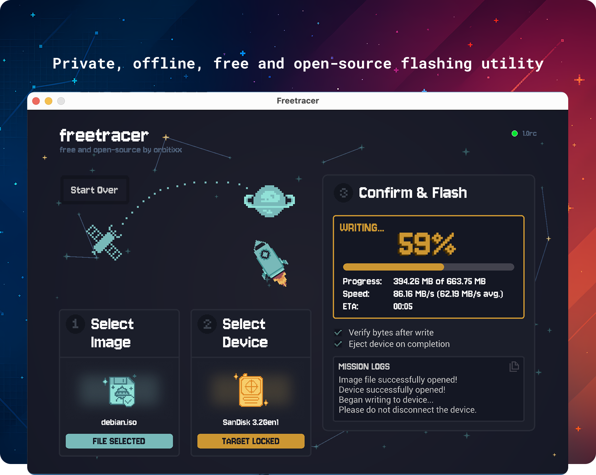
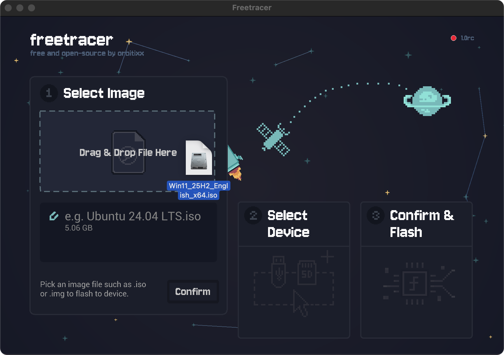
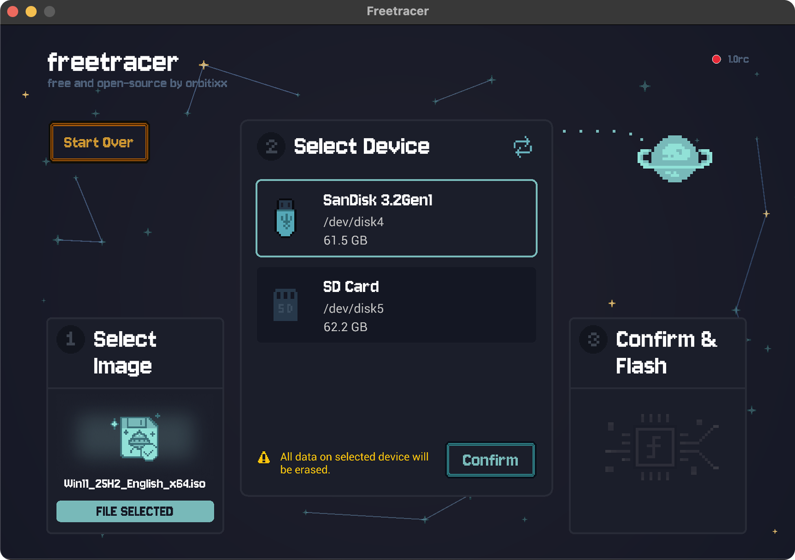
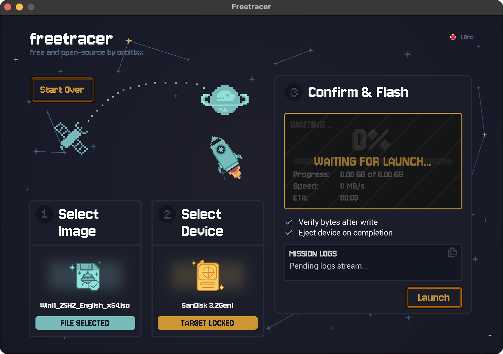

<p align="center">
  
</p>

<p align="center">
  <a href="https://github.com/orbitixx/freetracer/releases/latest"></a>
  
  
</p>

<p align="center"><i>A small, simple, <b>private</b>, offline-first and native image flasher.</i></p>

<p align="center">
  <a href="https://github.com/orbitixx/freetracer/releases/latest" style="text-decoration:none;">
    
  </a>
</p>

# Freetracer 

**Freetracer** is a small, fast, zero-tracking, open-source utility for securely writing common formats of bootable images (ISO/IMG/BIN, etc.) to removable media such as USB drives and SD cards. It’s built for people who value **privacy by default**: no ads, no telemetry, no surprise network calls — just a clean, friendly experience that stays out of your way. The signed bundle weighs in at roughly **5 MB** and launches instantly on native macOS hardware.

<p align="center">
  
</p>

---

<p align="center">
  
  <span>&nbsp;</span>
  
  <span>&nbsp;</span>
  
</p>

| 🛡️ **Privacy-first** | 🔌 **Works fully offline** | ⚡ **Native Zig speed** |
| --- | --- | --- |
| No telemetry, ads, or surprise permissions — just scoped access when you request it. | Zero network calls by default; optional version check you can disable entirely. | Small, written in Zig with 2 dependencies and little overhead. |

---

## 🤔 Why Freetracer?

If you’ve ever wondered why a calculator wants your microphone, you’re not alone. In a world of habitual data collection and ad-tech, Freetracer is intentionally boring: it flashes images, **stays offline**, and **doesn’t track you**. That’s it.

---

## ✨ Highlights

- Create bootable USB and SD cards with a few clicks  
- Supports ISO 9660, hybrid ISOs, and common image formats  
- Handles **large images (5GB+)** without fuss  
- Minimal, intuitive UI with tasteful pixel-art accents  
- **Offline-first** design  
  - The only optional network call is a version check to `github.com`  
  - You can disable update checks entirely  
- Safety rails to help you avoid writing to internal/system disks  
- Small, fast, and fully native (Zig + C/Obj-C) with minimal dependencies  
- **No ads, no trackers, no notifications, no spyware**, no opaque network requests  
- **Limited permissions, only when you ask for them**  
- Free and open source forever!

---

<video src="docs/demo_vid.mov" controls width="720" height="480">
  Your browser does not support the video tag.
</video>

## 🔐 Privacy, by design

It’s surprisingly common for simple utilities to request broad access or phone home. Freetracer doesn’t.

**What Freetracer does _not_ do:**
- Does not include analytics SDKs, telemetry, or A/B testing
- Does not collect, sell, or share personal data
- Does not show ads or use embedded ad trackers
- Does not request microphone, camera, Bluetooth, or other unrelated permissions

**What Freetracer _does_ do:**
- **Scoped file access**: When you pick or drag-and-drop an image, Freetracer requests access only to that item or folder (e.g., `~/Downloads`). By design, it will reject files selected from outside the logical user locations of `~/Downloads`, `~/Documents`, or `~/Desktop`.  
- **Privileged operations isolated**: On macOS, a small **Privileged Helper Tool** ([Apple-endorsed pattern](https://developer.apple.com/library/archive/documentation/Security/Conceptual/SecureCodingGuide/Articles/AccessControl.html#//apple_ref/doc/uid/TP40002589-SW2)) performs tasks that require elevated privileges (e.g., unmounts, disk eject). The main app talks to it over XPC using a **Mach service**, keeping sensitive operations contained and auditable.
- **Transparent permissions**: The helper inherits only the permissions the app explicitly has. No silent escalation, no surprise access.

**Transparency ledger** (full details in [Security & Privacy guidance](docs/security-and-privacy.md)):

| What we ask for | Why we need it | When it’s requested |
| --- | --- | --- |
| `Downloads`, `Documents`, `Desktop` folder access | Access image files you explicitly choose | Only after you pick or drop a file |
| Privileged helper install (macOS) | Safely unmount and write removable media using macOS’ helper pattern | First time install and on version updates |
| Optional update check (GitHub) | Let you know when a new build is available | Only if you keep auto-checks enabled |

> **Privacy in practice:** Freetracer rejects files outside common user folders by design, and privileged work happens inside a sandboxed helper process. Peek under the hood in the [architecture overview](docs/architecture-overview.md).

---

## 🖥️ Supported platforms

- **macOS** 10.13 High Sierra and later
- **Linux** — **work in progress** (coming soon)
- **Windows** — not planned; we recommend [Rufus](https://rufus.ie)

---

## 🚀 Getting started

1. **Download** the latest release for macOS (universal or Apple Silicon build).  
2. **Drag to Applications**.  
3. **Launch Freetracer**, select your image file and target drive, and flash.

> On first use, macOS may prompt for access to files you choose — this is expected and limited to your selection.

---

## 🧩 Building from source (macOS)

**Prerequisites**
- [Zig](https://ziglang.org/) (matching the version in this repo’s build files)
- Xcode Command Line Tools (for SDKs and codesign)
- A valid Apple Developer ID certificate for signing the helper and app (recommended for local testing; required for distribution)

**Build steps**

Populate the property lists:
1. For the main app, edit `./macos/Info.plist` with your Apple Developer Certificate ID, amend bundle id in `./src/env.zig`
2. For the helper, edit `./macos-helper/src/env.zig` with your Apple Developer Certificate ID, similalry amend the bundle IDs.

> [!NOTE]
> If you're not using an organizational certificate and using a personal one, modify the `[subject.OU] = XXXXXXXX` fields to: `[subject.CN] = FirstName LastName (Apple Development)`. Run `codesign -d -r- "path/to/Freetracer.app" 2>/dev/null` for codesign to generate the exact string to put in the plist key string.

> [!IMPORTANT]
> Codesigning is required for XPC communication and for `launchd` to register and launch the helper binary.

Build the library, helper, and main app:

```bash
zig build -Dtarget=aarch64-macos --release=safe bundle
```

Codesign the helper and the app (replace IDs with your own):

```bash
codesign --force --sign "{Your Apple Developer Certificate ID}" \
  -i "com.{your-id}.freetracer-helper" \
  ./Freetracer.app/Contents/Library/LaunchServices/com.{your-id}.freetracer-helper

codesign --force --sign "{Your Apple Developer Certificate ID}" \
  -i "com.{your-id}.freetracer" \
  --options=runtime \
  ./Freetracer.app
```

> [!TIP] 
> For Intel builds, adjust the `-Dtarget` accordingly (e.g., `x86_64-macos`).

---

## 🤝 Contributing

We welcome contributions of all kinds — bug reports, docs, code, design, and testing.

- Please read **`CONTRIBUTING.md`** for our workflow, coding guidelines, and tips for navigating the codebase.  
- You can help even without writing code — thoughtful issues and UX feedback are incredibly valuable.

---

## 💬 Feedback & community

- **Star us on GitHub** to show support  
- **Report bugs** in the issue tracker  
- **Email** us with ideas or questions [community@orbitixx.com](mailto:community@orbitixx.com)  
- **Follow** Orbitixx on BlueSky, X (Twitter), and Instagram

---

## 📚 Additional Resources

- [Contributing guide](CONTRIBUTING.md)
- [Architecture overview](docs/architecture-overview.md)
- [Security & privacy guidance](docs/security-and-privacy.md)

---

## License

Freetracer is currently licensed under the **Apache License, Version 2.0**. 

> **Note:** Dual-licensing (Apache-2.0/GPLv3) has been discussed; if adopted, this section will be updated accordingly. Until then, **Apache-2.0 applies**.

---

## Attribution for forks & derivatives

If you reuse Freetracer’s source code or user interface, please include a visible, human-readable mention of **“Freetracer by Orbitixx”** and a clickable link to **https://orbitixx.com** in user-facing areas (e.g., **About** and **Main Menu** screens). This honors contributor work and satisfies license attribution requirements.

---

## © Copyright

Licensed under the **Apache License, Version 2.0** (TBD).

---

*Built with care — and without trackers.*
