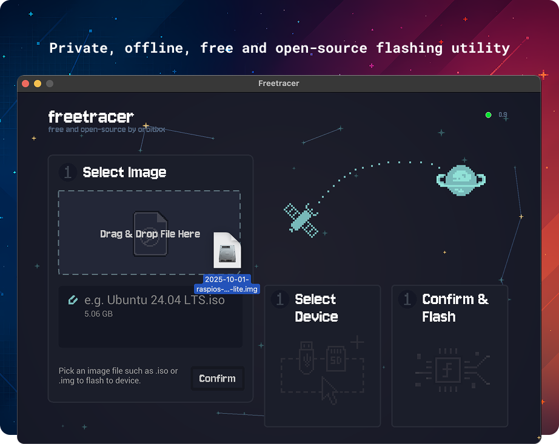

<p align="center">
  
</p>

# Freetracer — a beautiful, simple, **private**, offline-first image flasher

**Freetracer** is a fast, zero-tracking, open-source utility for securely writing bootable images (ISO/IMG/BIN, etc.) to removable media such as USB drives and SD cards. It’s built for people who value **privacy by default**: no ads, no telemetry, no surprise network calls — just a clean, friendly experience that stays out of your way.

<p align="center">
  
</p>

- 🧭 **Focused**: does one job — flashing images — and does it well  
- 🛡️ **Private**: limited, explicit permissions; no analytics or tracking  
- 🔌 **Offline-first**: works entirely offline (optional update check you can disable)  
- ⚡ **Fast & native**: written in Zig with a dash of C/Obj-C  
- 🆓 **Open source**: free to use, inspect, and improve

---

## ✨ Highlights

- 💾 Create bootable USB and SD cards with a few clicks  
- 💿 Supports ISO 9660, hybrid ISOs, and common image formats  
- ⛰️ Handles **large images (5GB+)** without fuss  
- 🎛️ Minimal, intuitive UI with tasteful pixel-art accents  
- 🛜 **Offline-first** design  
  - The only optional network call is a version check to `github.com`  
  - You can disable update checks entirely  
- 🔐 Safety rails to help you avoid writing to internal/system disks  
- ⚡ Small, fast, and fully native (Zig + C/Obj-C)  
- ❌ **No ads, no trackers, no notifications, no spyware**, no opaque network requests  
- 📝 **Limited permissions, only when you ask for them**  
- 🤑 Free and open source

---

## 🧠 Why Freetracer?

If you’ve ever wondered why a calculator wants your microphone, you’re not alone. In a world of habitual data collection and ad-tech, Freetracer is intentionally boring: it flashes images, **stays offline**, and **doesn’t track you**. That’s it.

---

## 🔒 Privacy, by design

It’s surprisingly common for simple utilities to request broad access or phone home. Freetracer doesn’t.

**What Freetracer does _not_ do:**
- Does not include analytics SDKs, telemetry, or A/B testing
- Does not collect, sell, or share personal data
- Does not show ads or use embedded ad trackers
- Does not request microphone, camera, Bluetooth, or other unrelated permissions

**What Freetracer _does_ do:**
- **Scoped file access**: When you pick or drag-and-drop an image, Freetracer requests access only to that item or folder (e.g., `~/Downloads`). By design, it will reject files selected from outside the logical user locations of `~/Downloads`, `~/Documents`, or `~/Desktop`.  
- **Privileged operations isolated**: On macOS, a small **Privileged Helper Tool** (Apple-endorsed pattern) performs tasks that require elevated privileges (e.g., unmounts, disk eject). The main app talks to it over XPC using a **Mach service**, keeping sensitive operations contained and auditable.
- **Transparent permissions**: The helper inherits only the permissions the app explicitly has. No silent escalation, no surprise access.

**macOS usage descriptions / entitlements** used by the app (for clarity and transparency):

```plist
<key>NSDownloadsFolderUsageDescription</key>
<string>Freetracer needs access to Downloads folder scope to access a specific ISO file within it.</string>
<key>NSDocumentsFolderUsageDescription</key>
<string>Freetracer needs access to Documents folder scope to access a specific ISO file within it.</string>
<key>NSDesktopFolderUsageDescription</key>
<string>Freetracer needs access to Desktop folder scope to access a specific ISO file within it.</string>	

<key>MachServices</key>
<dict>
  <key>com.orbitixx.freetracer</key>
  <true/>
</dict>
```

> **Note:** These descriptions reflect how Freetracer operates today: explicit, limited access based on your actions, and a clear separation of privileges for system-level tasks.

---


## 🖥️ Supported platforms

- 🍎 **macOS** 10.13 High Sierra and later
- 🐧 **Linux** — **work in progress** (coming soon)
- 🪟 **Windows** — not planned; we recommend [Rufus](https://rufus.ie)

---

## 🚀 Getting started

1. **Download** the latest release for macOS (universal or Apple Silicon build).  
2. **Drag to Applications**.  
3. **Launch Freetracer**, select your image file and target drive, and flash.

> On first use, macOS may prompt for access to files you choose — this is expected and limited to your selection.

---

## 🧩 Building from source (macOS)

**Prerequisites**
- [Zig](https://ziglang.org/) (matching the version in this repo’s build files)
- Xcode Command Line Tools (for SDKs and codesign)
- A valid Apple Developer ID certificate for signing the helper and app (recommended for local testing; required for distribution)

**Build steps**

Build the library, helper, and main app:

```bash
cd ./freetracer-lib/
zig build -Dtarget=aarch64-macos --release=safe

cd ../macos-helper/
zig build -Dtarget=aarch64-macos --release=safe

cd ..
zig build -Dtarget=aarch64-macos --release=safe
```

Create the app bundle and copy artifacts:

```bash
cp ./src/resources/* ./Freetracer.app/Contents/Resources/
cp ./macos-helper/zig-out/bin/macos_helper \
   ./Freetracer.app/Contents/Library/LaunchServices/com.{your-id}.freetracer-helper
cp ./macos/Info.plist ./Freetracer.app/Contents/
cp ./zig-out/bin/freetracer ./Freetracer.app/Contents/MacOS/Freetracer
```

Codesign the helper and the app (replace IDs with your own):

```bash
codesign --force --sign "{Your Apple Developer Certificate ID}" \
  -i "com.{your-id}.freetracer-helper" \
  ./Freetracer.app/Contents/Library/LaunchServices/com.{your-id}.freetracer-helper

codesign --force --sign "{Your Apple Developer Certificate ID}" \
  -i "com.{your-id}.freetracer" \
  --options=runtime \
  ./Freetracer.app
```

> **Tip:** For Intel builds, adjust the `-Dtarget` accordingly (e.g., `x86_64-macos`). For universal binaries, build each arch and lipo the outputs.

---

## 🤝 Contributing

We welcome contributions of all kinds — bug reports, docs, code, design, and testing.

- Please read **`CONTRIBUTING.md`** for our workflow, coding guidelines, and tips for navigating the codebase.  
- Governance is documented in **`docs/GOVERNANCE.md`**.  
- You can help even without writing code — thoughtful issues and UX feedback are incredibly valuable.

---

## 💬 Feedback & community

- ⭐ **Star us on GitHub** to show support  
- 🐞 **Report bugs** in the issue tracker  
- ✉️ **Email** us with ideas or questions  
- 🌐 Follow Orbitixx on BlueSky, X (Twitter), and Instagram

---

## 📄 License

Freetracer is currently licensed under the **Apache License, Version 2.0**. 

> **Note:** Dual-licensing (Apache-2.0/GPLv3) has been discussed; if adopted, this section will be updated accordingly. Until then, **Apache-2.0 applies**.

---

## 📣 Attribution for forks & derivatives

If you reuse Freetracer’s source code or user interface, please include a visible, human-readable mention of **“Freetracer by Orbitixx”** and a clickable link to **https://orbitixx.com** in user-facing areas (e.g., **About** and **Main Menu** screens). This honors contributor work and satisfies license attribution requirements.

---

## © Copyright

Licensed under the **Apache License, Version 2.0** (TBD).

---

*Built with care — and without trackers.*

